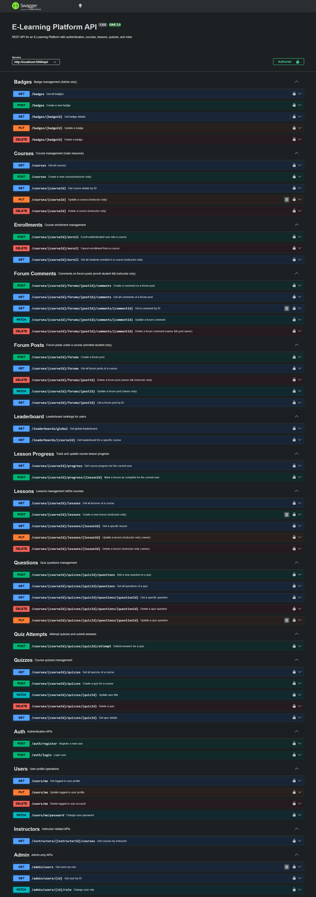

# E-Learning Platform API

A RESTful API built using Node.js, Express, and MySQL for creating and managing an e-learning platform where instructors can create courses, and students can enroll in courses, access course materials, and attempt quizzes. The platform also features user authentication and authorization, discussion forums, progress tracking, and gamification.

## Features

- JWT-based authentication & authorization
- Role-based access control (Student, Instructor, Admin)
- Course & lesson management (CRUD)
- Student enrollment system
- Quiz creation and attempts
- Quiz scoring & result tracking
- Lesson progress tracking
- Gamification (badges & leaderboard)
- Request validation using Zod
- API testing using Supertest
- Swagger/OpenAPI documentation

### Tech Stack

- Node.js
- Express.js
- MySQL / MariaDB
- JWT (Authentication)
- Zod (Validation)
- Supertest + Jest (Testing)
- Swagger (API Documentation)

## Prerequisites

- Node.js v18+
- MySQL / MariaDB v10+

## Installation

1. Clone the repository:
   `git clone https://github.com/imranmalakzai/elearning-platform-api`

`cd elearning-platform-api`

2. Install the dependencies:

```
npm install
```

3. Environment variables

Create a .env file in the root directory:

PORT=5000
DB_HOST=localhost
DB_USER=root
DB_PASSWORD=your_password
DB_NAME=elearning_db

JWT_SECRET=your_jwt_secret
JWT_EXPIRES_IN=7d

4. Database Setup

Open your MySQL client (e.g., Workbench, phpMyAdmin).
Execute the elerning-platefrom SQL file located in the schema folder.

6. Start the server:

```
npm run start
```

The API will be available at `http://localhost:5000/api`.
The swagger UI will be avalible at `http://localhost:5000/api/docs`.
The swagger UI will be avalible at `http://localhost:5000/api-docs.json`.

## API Endpoints

### User

- POST `/api/auth/register`: Register a new user
- POST `/api/auth/login`: Login an existing user
- GET `/api/users/me`: Get the logged-in user's profile
- PUT `/api/users/me`: Update the logged-in user's profile
- Patch `/api/users/me/password` : Update logged-in user's password
- DELETE `/api/users/me`: Delete the logged-in user's profile
- GET `/api/admin/users`: Get all users (Admin only)
- GEt `api/admin/users?role` Get users by role ['student' | 'instructor' | 'admin'] (Admin only)
- GET `/api/admin/users/id`: Get a user by Id (Admin only)
- GET `/api/instructors/:id/courses`: Get Instructor Courses

### Courses

- POST `/api/courses`: Create a new course (Instructor only)
- GET `/api/courses`: Get all courses
- GET `/api/courses/:courseId`: Get a course by ID
- PUT `/api/courses/:courseId`: Update a course (Instructor only)
- DELETE `/api/courses/:courseId`: Delete a course (Instructor only)

### enrollments

- POST `/api/courses/:courseId/enroll` : Enroll to a new course (authentication users)
- GET `/api/courses/:courseId/enroll` : Get all students enrolled in course (Instructor only)
- DELETE `/api/courses/:courseId/enroll` : Cancell enrollment in a course (enrolled student)

### Lessons

- POST `/api/courses/:courseId/lessons`: Create a lesson in a course (Instructor only | owner)
- GET `/api/courses/:courseId/lessons` : Get all lessons of a course
- GET `/api/courses/:courseId/lessons/:lessonId` : Get a lesson by Id
- PUT `/api/courses/:courseId/lessons/:lessonId` : Update a course lesson (Instructor only | owner)
- DELETE `/api/courses/:courseId/lessons/:lessonId` : Delete a lesson (Instructor only | owner)

### Quizzes

- POST `/api/courses/:courseId/quizzes`: Create a quiz for a course (Instructor only)
- GET `/api/courses/:courseId/quizzes`: Get all quizzes for a course (enrolled student only)
- GET `/api/courses/:courseId/quizzes/:quizId` : Get a quizz by id (enrolled student only)
- PUT `/api/courses/:courseId/quizzes/:quizId` : Update a quizz by id (instructor only)
- Delete `/api/courses/:courseId/quizzes/:quizId`: Delete a quizz by id (instructor only)

### Questions

- POST `/api/courses/:courseId/quizzes/:quizId/questions` : Create a question for a quizz (Instructor only)
- GET `/api/courses/:courseId/quizzes/:quizId/questions` : Get all questions of a quizz (enrolled student only)
- GET `/api/courses/:courseId/quizzes/:quizId/questions/:questionId` : Get a question by Id (enrolled student only)
- PUT `/api/courses/:courseId/quizzes/:quizId/questions/:questionId` : Update a question (Instructor only)

### quiz attempt

- POST `/api/courses/:courseId/quizzes/:quizId/attempt` : Attempt a quizz (enrolled student only)

### Forums POSTS

- POST `/api/courses/:courseId/forums`: Create a forum post for a course (Enrolled users)
- GET `/api/courses/:courseId/forums`: Get all forum posts for a course (Enrolled user)
- PUT `/api/courses/:courseId/forums/:postId`: Update a forum post (Post author only)
- DELETE `/api/courses/:courseId/forums/:postId`: Delete a forum post (Post author only)
- GET `/api/courses/:courseId/forums/:postId`: Get a forum post by ID

### Forums Comments

- POST `/api/courses/:courseId/forums/:postId/comments`: Create a comment for a forum post (enrolled users)
- GET `/api/courses/:courseId/forums/:postId/comments`: Get all comments for a forum post
- PATCH `/api/courses/:courseId/forums/:postId/comments/:commentId`: Update a comment (Comment author only)
- DELETE `/api/courses/:courseId/forums/:postId/comments/:commentId`: Delete a comment (Comment || Post author)

### Badges

- POST `/api/badges`: Create a badge (Admin only)
- GET `/api/badges`: Get all badges (Admin only)
- PUT `/api/badges/:badgeId`: Update a badge (Admin only)
- DELETE `/api/badges/:badgeId`: Delete a badge (Admin only)

### Progress

- GET `/api/courses/:courseId/progress`: Get course progress for the current user (Student only, enrolled courses)
- POST `/api/courses/:courseId/progress/:lessonId`: Mark a lesson as completed (Student only, enrolled courses)

### Leaderboard

- GET `/api/leaderboard/global`: Get the leaderboard based on total points
- GET `/api/leaderboard/:courseId` Get leaderboard for a specific course



## License

This project is licensed under the MIT License. See the [LICENSE](LICENSE) file for details.
