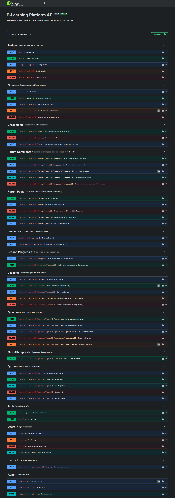

## E-Learning Platform API

A production-ready RESTful API built with **Node.js**, **Express**, and **MySQL** for managing a full-featured e-learning platform. The system enables instructors to create and manage courses, lessons, quizzes, and assessments, while students can enroll in courses, track progress, participate in discussions, and earn badges through gamification.

The API follows a modular, scalable architecture with robust authentication, authorization, validation, testing, and documentation.

---

## Key Features

- JWT-based authentication and authorization
- Role-based access control (Student, Instructor, Admin)
- Course and lesson management (CRUD)
- Student enrollment management
- Quiz creation, attempts, and scoring
- Lesson and course progress tracking
- Discussion forums (posts and comments)
- Gamification system (badges and leaderboards)
- Request validation using Zod
- Automated API testing with Supertest and Jest
- Swagger / OpenAPI documentation

---

## Tech Stack

- **Runtime:** Node.js
- **Framework:** Express.js
- **Database:** MySQL / MariaDB
- **Authentication:** JWT
- **Validation:** Zod
- **Testing:** Jest, Supertest
- **Documentation:** Swagger (OpenAPI)
- **Caching:** Redis

---

## Prerequisites

- Node.js v18 or higher
- MySQL or MariaDB v10 or higher
- npm (comes with Node.js)
- Redis server

---

## Installation

### 1. Clone the Repository

```bash
git clone https://github.com/imranmalakzai/elearning-platform-api
cd elearning-platform-api
```

### 2. Install Dependencies

```bash
npm install
```

### 3. Environment Configuration

Create a `.env` file in the project root and configure the following variables:

```env
PORT=5000

DB_HOST=localhost
DB_USER=root
DB_PASSWORD=your_password
DB_NAME=elearning_db

JWT_SECRET=your_jwt_secret
JWT_EXPIRES_IN=7d

REDIS_CLIENT_URL= "redis://127.0.0.1:6379"
```

### 4. Database Setup

1. Open your MySQL client (MySQL Workbench, phpMyAdmin, etc.).
2. Locate the SQL schema file inside the `schema` directory.
3. Execute the provided SQL script to create the database structure.

### 5. Start the Application

```bash
npm run start
```

Run automated tests:

```bash
npm run test
```

---

## API Access

- **Base URL:** `http://localhost:5000/api`
- **Swagger UI:** `http://localhost:5000/api/docs`
- **Swagger JSON:** `http://localhost:5000/api-docs.json`

---

## API Endpoints

### Authentication & Users

- `POST /api/auth/register` — Register a new user
- `POST /api/auth/login` — User login
- `GET /api/users/me` — Get current user profile
- `PUT /api/users/me` — Update current user profile
- `PATCH /api/users/me/password` — Update password
- `DELETE /api/users/me` — Delete user account

#### Admin Only

- `GET /api/admin/users` — Get all users
- `GET /api/admin/users?role=student|instructor|admin` — Filter users by role
- `GET /api/admin/users/:id` — Get user by ID

#### Instructor

- `GET /api/instructors/:id/courses` — Get instructor’s courses

---

### Courses

- `POST /api/courses` — Create a course (Instructor)
- `GET /api/courses` — Get all courses
- `GET /api/courses/:courseId` — Get course by ID
- `PUT /api/courses/:courseId` — Update course (Instructor | Owner)
- `DELETE /api/courses/:courseId` — Delete course (Instructor | Owner)

---

### Enrollments

- `POST /api/courses/:courseId/enroll` — Enroll in a course (Authenticated users)
- `GET /api/courses/:courseId/enroll` — Get enrolled students (Instructor)
- `DELETE /api/courses/:courseId/enroll` — Cancel enrollment (Enrolled student)

---

### Lessons

- `POST /api/courses/:courseId/lessons` — Create lesson (Instructor | Owner)
- `GET /api/courses/:courseId/lessons` — Get all lessons
- `GET /api/courses/:courseId/lessons/:lessonId` — Get lesson by ID
- `PUT /api/courses/:courseId/lessons/:lessonId` — Update lesson (Instructor | Owner)
- `DELETE /api/courses/:courseId/lessons/:lessonId` — Delete lesson (Instructor | Owner)

---

### Quizzes

- `POST /api/courses/:courseId/quizzes` — Create quiz (Instructor)
- `GET /api/courses/:courseId/quizzes` — Get quizzes (Enrolled students)
- `GET /api/courses/:courseId/quizzes/:quizId` — Get quiz by ID
- `PUT /api/courses/:courseId/quizzes/:quizId` — Update quiz (Instructor)
- `DELETE /api/courses/:courseId/quizzes/:quizId` — Delete quiz (Instructor)

---

### Questions

- `POST /api/courses/:courseId/quizzes/:quizId/questions` — Create question (Instructor)
- `GET /api/courses/:courseId/quizzes/:quizId/questions` — Get quiz questions
- `GET /api/courses/:courseId/quizzes/:quizId/questions/:questionId` — Get question by ID
- `PUT /api/courses/:courseId/quizzes/:quizId/questions/:questionId` — Update question (Instructor)

---

### Quiz Attempts

- `POST /api/courses/:courseId/quizzes/:quizId/attempt` — Attempt quiz (Enrolled students)

---

### Forums – Posts

- `POST /api/courses/:courseId/forums` — Create forum post (Enrolled users)
- `GET /api/courses/:courseId/forums` — Get forum posts
- `GET /api/courses/:courseId/forums/:postId` — Get post by ID
- `PUT /api/courses/:courseId/forums/:postId` — Update post (Author only)
- `DELETE /api/courses/:courseId/forums/:postId` — Delete post (Author only)

---

### Forums – Comments

- `POST /api/courses/:courseId/forums/:postId/comments` — Create comment
- `GET /api/courses/:courseId/forums/:postId/comments` — Get comments
- `PATCH /api/courses/:courseId/forums/:postId/comments/:commentId` — Update comment (Author)
- `DELETE /api/courses/:courseId/forums/:postId/comments/:commentId` — Delete comment (Comment or Post author)

---

### Badges

- `POST /api/badges` — Create badge (Admin)
- `GET /api/badges` — Get all badges (Admin)
- `PUT /api/badges/:badgeId` — Update badge (Admin)
- `DELETE /api/badges/:badgeId` — Delete badge (Admin)

---

### Progress Tracking

- `GET /api/courses/:courseId/progress` — Get course progress (Student)
- `POST /api/courses/:courseId/progress/:lessonId` — Mark lesson as completed

---

### Leaderboard

- `GET /api/leaderboard/global` — Global leaderboard
- `GET /api/leaderboard/:courseId` — Course-specific leaderboard

---

## API Documentation Preview



---

## License

This project is licensed under the **MIT License**.
See the [LICENSE](LICENSE) file for more information.
